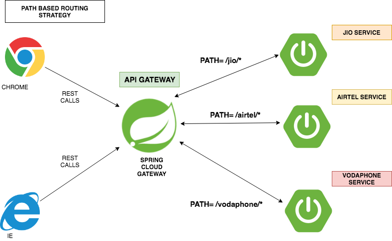
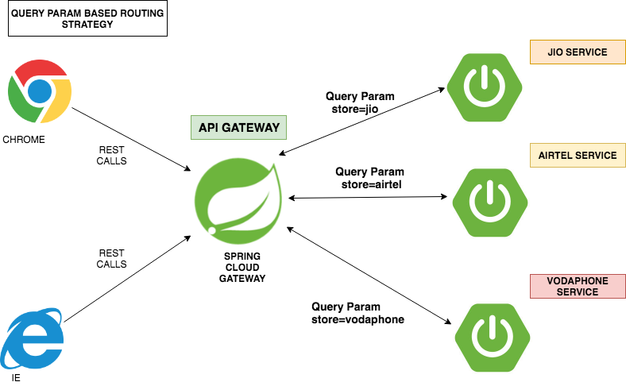

# spring-cloud-gateway-routing
This project demonstrates the usage of API gateway between microservices using spring cloud gateway


## what is spring cloud gateway ?

<p>Spring Cloud Gateway is an intelligent and programmable router based on Project Reactor.</p>





<table>


 <tr>
    <th style="text-align:left">Name</th>
    <th style="text-align:left">Port</th> 
    <th style="text-align:left">Description</th>
  </tr>
  <tr>
    <td><a href="https://github.com/BarathArivazhagan/spring-cloud-gateway-routing/tree/master/spring-cloud-gateway"> spring-cloud-gateway</a></td>
    <td>9500</td>
    <td>spring cloud gateway router</td>
  </tr>
  <tr>
    <td><a href="https://github.com/BarathArivazhagan/spring-cloud-gateway-routing/tree/master/jio-store-service">jio-store-service</a></td>
    <td>9501</td>
    <td>jio microservice</td>
  </tr>
  <tr>
    <td><a href="https://github.com/BarathArivazhagan/spring-cloud-gateway-routing/tree/master/airtel-store-service">airtel-store-service</a></td>
    <td>9502</td>
    <td>airtel microservice</td>
  </tr>
  <tr>
    <td><a href="https://github.com/BarathArivazhagan/spring-cloud-gateway-routing/tree/master/vodaphone-store-service">vodaphone-store-service</a></td>
    <td>9503</td>
    <td>vodaphone microservice</td>
  </tr>
   <tr>
    <td><a href="https://github.com/BarathArivazhagan/spring-cloud-gateway-routing/tree/master/config-server">config-server</a></td>
    <td>8888</td>
    <td>spring cloud config server </td>
  </tr>
  
</table>


## How to build and run ?

 * Download/Clone the repository : 
   
   ```
   $ git clone https://github.com/BarathArivazhagan/spring-cloud-gateway-routing.git
   $ cd spring-cloud-gateway-routing
   $ ./mvnw clean install
   ```

 * To run the application :

	  ```
	 $ docker-compose up
	  ```

## How to test the application ? 

Use gateway routes to route to respective microservices. 

spring cloud gateway route definition : 

```
spring:
  cloud:
    gateway:
      routes:
        - id: jio-service
          uri: http://localhost:9501
          predicates:
          - Path= /jio/*
          filters:
          - StripPrefix=1 # required to strip the prefix made to the request . Ex /jio/customers request will go to jio service as /customers 
        - id: airtel-service
          uri: http://localhost:9502
          predicates:
          - Path= /airtel/*
          filters:
          - StripPrefix=1
        - id: vodaphone-service
          uri: http://localhost:9503
          predicates:
          - Path= /vodaphone/*
          filters:
          - StripPrefix=1
```

```
$ curl http://localhost:9500/jio/customers

[
    {
        "customerName": "barath-jio",
        "customerAge": 25,
        "customerGender": "MALE"
    }
]

$ curl http://localhost:9500/airtel/customers

[
    {
        "customerName": "barath-airtel",
        "customerAge": 25,
        "customerGender": "MALE"
    }
]

$ curl http://localhost:9500/vodaphone/customers

[
    {
        "customerName": "barath-vodaphone",
        "customerAge": 25,
        "customerGender": "MALE"
    }
]
```


#### Header based routing strategy 


Enable <b>SPRING_PROFILES_ACTIVE=header</b> to test header based routing strategy


#### Query param based routing strategy



Enable <b>SPRING_PROFILES_ACTIVE=query</b> to test query param based routing strategy


#### Future Actions : 

* Introduce hystrix stream and feign clients to interact with other microservices.


## How to rebuild the project after the changes? 

```
  docker-compose build
```


## References 

* http://projects.spring.io/spring-cloud/
* http://cloud.spring.io/spring-cloud-netflix/spring-cloud-netflix.html
* https://cloud.spring.io/spring-cloud-gateway/
* http://cloud.spring.io/spring-cloud-static/spring-cloud-gateway/2.0.0.M8/single/spring-cloud-gateway.html

